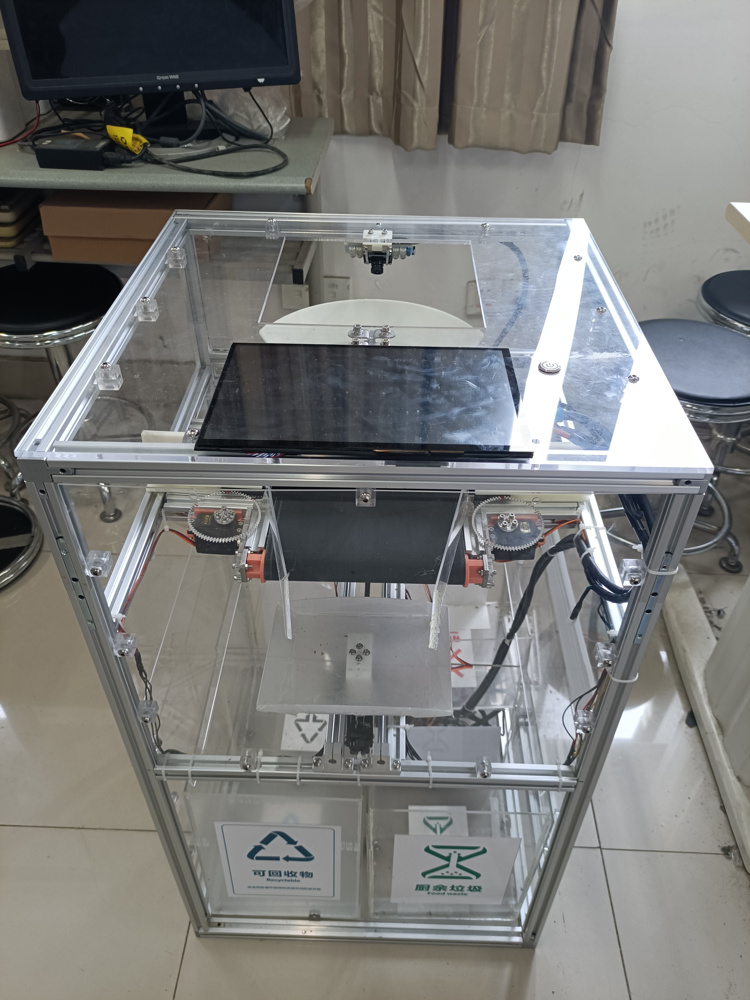
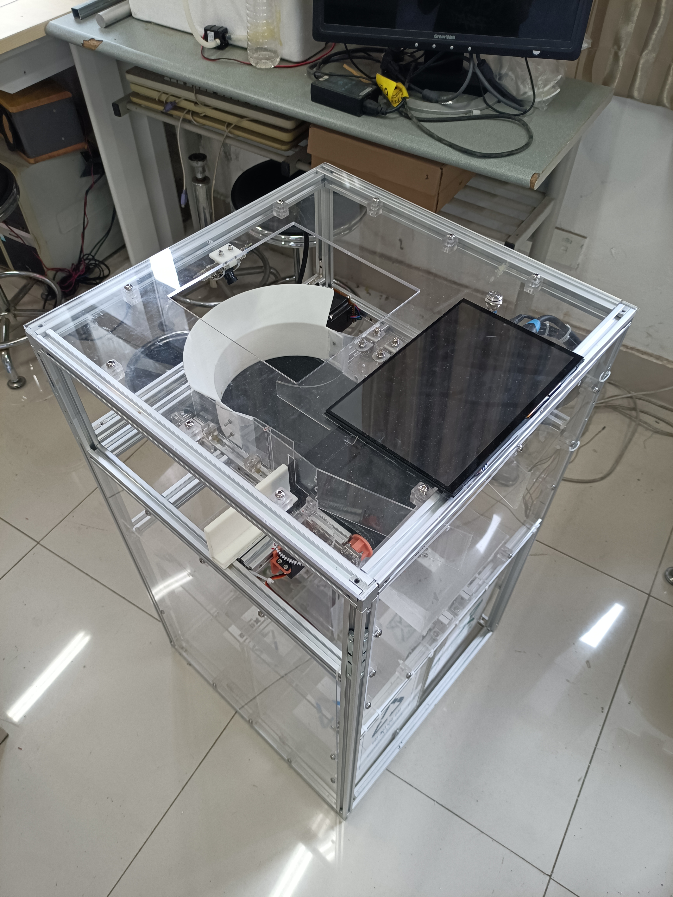
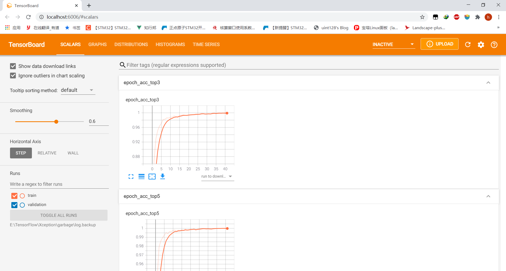

# 一个基于Xception图像识别的垃圾分类项目

正视图

侧视图

UI图


## 硬件要求
**<font color="red">请务必使用4G及以上的Linux硬件</font>**  
**建议使用Jetson Nano(约26fps) 或树莓派4B (约0.3fps)**  

> 2022-05-08更新: 建议使用RKNN(RockChip)代替Jetson.

## 图像识别部分
### Xception 图像分类实现
#### 模型训练
请务必使用自己的摄像头针对自己的设备添加足够训练集之后再进行训练。  
```
cd Xception
python ./Train.py
```
注意根据实际路径修改以下内容:  
```
# Configure
# 以下内容请和 Valid.py 中的匹配
## 源图片的总文件夹位置
Base_Dir = "E:/TensorFlow/datasets/garbage_finally/"
train_dir = Base_Dir + "Train"
validation_dir = Base_Dir + "Valid"
log_dir = "./log"
```

#### 模型校验
```
cd Xception
python ./Valid.py
```
注意根据实际文件路径修改以下内容:  
```
# Configure
## 源图片的总文件夹位置, 尽量保证输入图片的长宽比为1:1即可, 程序会自动缩放。
Base_Dir   = '../../datasets/garbage_finally/'
## 权重文件的位置
Weight_File_Path = "./weights/epoch-140-val_acc-0.9651-acc_top3-1.0000-acc_top5-1.0000.hdf5"
```

#### 实时监测
```
cd Xception
python ./Live.py
```
至此, Xception图像分类部分完毕。但是仍然无法进行实际的图像识别流程, 原因如下文 `Xception具体操作流程`。

#### TensorBoard绘图
```
cd Xception
tensorboard --logdir ./log
```
然后根据提示访问对应网址即可


### Xception具体操作流程
由于图像分类无法对未知物体或无物体时的结果进行正确预测, 所以需要进行一些预处理。


### yolo-fastest 图像识别实现
由于RK3399, Jetson Nano等廉价Linux开发板算力较弱无法流畅运行yolov4, 外加yolov4训练对电脑需求过高, 故本项目不再使用yolov4实现。  
本项目使用了基于华为垃圾分类竞赛数据集基础上的拓展数据集 (读起来真拗口。。)  

本项目使用的源dataset (VOC格式): https://aistudio.baidu.com/aistudio/datasetdetail/70610  
本项目使用的源dataset (图像分类格式): 

我根据比赛要求改进的dataset:  
[Classification](./dataset/Classification)  
[yolo-mark](./dataset/yolo-mark)

需要配置[Darknet](https://github.com/AlexeyAB/darknet)环境。  

由于竞赛需求, 本人只使用了上述数据集的部分种类  
```
classes = {"干电池" : 0, "陶瓷器皿" : 1, "易拉罐" : 2, "烟蒂" : 3, "果皮果肉" : 4, "菜帮菜叶" : 5, "饮料瓶" : 6}
```

本人的 yolo-fastest 实现:  
使用方法:  
```
cd yolo-fastest
darknet detector demo .\train.data .\yolo-fastest.cfg .\backup\yolo-fastest_best.weights -c 0
```


但是实测效果一般, 故比赛中又改为了 Xception。

## STM32端具体实现

## 机械结构及设计思路
暂未整理
