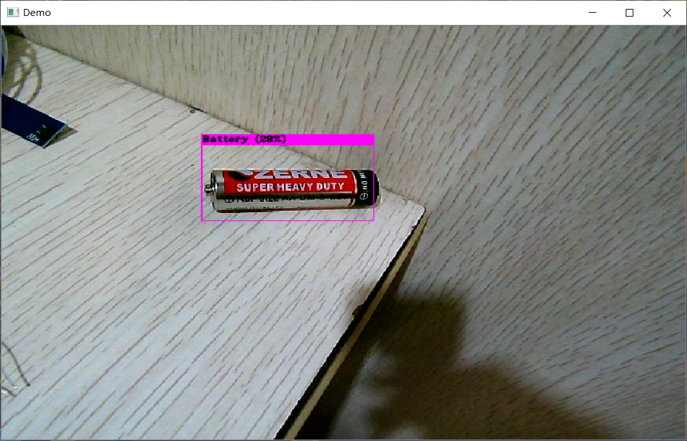

# 一个基于Xception图像识别的垃圾分类项目

## Xception
### 模型训练

### 模型校验

### 实时监测
```
cd Xception
python ./Live.py
```


## yolo-fastest实现
由于RK3399, Jetson Nano等廉价Linux开发板算力较弱无法流畅运行yolov4, 外加yolov4训练对电脑需求过高, 故本项目不再使用yolov4实现。
本项目使用了基于华为垃圾分类竞赛数据集基础上的拓展数据集 (读起来真拗口。。)
源dataset: https://aistudio.baidu.com/aistudio/datasetdetail/70610

需要配置[Darknet](https://github.com/AlexeyAB/darknet)环境。

由于竞赛需求, 本人只使用了上述数据集的部分种类
```
classes = {"干电池" : 0, "陶瓷器皿" : 1, "易拉罐" : 2, "烟蒂" : 3, "果皮果肉" : 4, "菜帮菜叶" : 5, "饮料瓶" : 6}
```

本人的 yolo-fastest 实现:
使用方法:
```
cd yolo-fastest
darknet detector demo .\train.data .\yolo-fastest.cfg .\backup\yolo-fastest_best.weights -c 0
```


但是实测效果一般, 故比赛中又改为了 Xception

